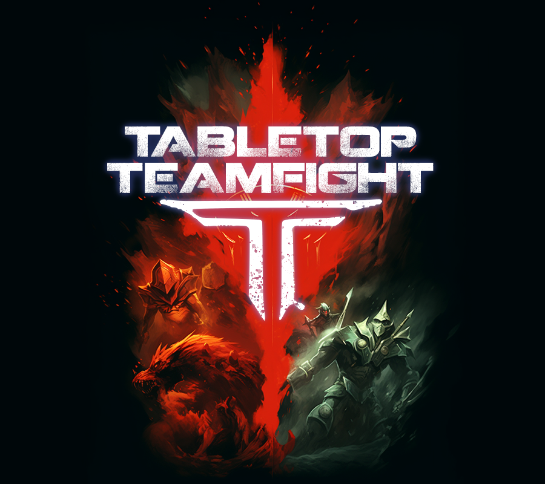
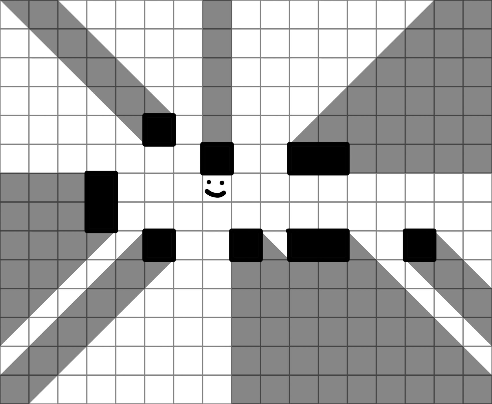
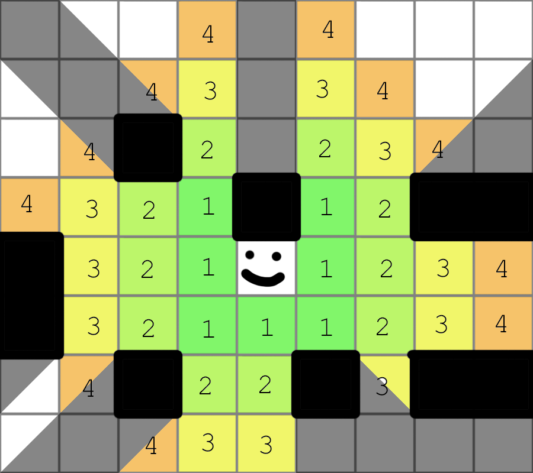

# Gameplay Overview

- 2 Players
- 30 minutes
- Medium complexity

Tabletop Teamfight is tactics game about finding strong synergies and counters, designed for  
[Tabletop Simulator](https://store.steampowered.com/app/286160/Tabletop_Simulator/).
It borrows familiar characters from other games so that players can strategize with their existing
knowledge.

Gameplay is quick and streamlined for playing several games in a row, each with a different
pool of heroes for a fresh puzzle.

[Discord](https://discord.gg/uYCNuM3BXr)

# Setup

## First Game Setup

Each Game Set has an introductory setup recommended for learning the game or that set.

Just press the Intro Setup button next to the set's bag, and it will lay out the map and hero decks.

You only need to lay out hero cards and place and color the figures.

## Standard Setup

1. Choose 1-3 Sets. Each Set represents a game, and can contain heroes, maps, and additional rules.
2. Drag the sets into the brown randomizer bag and press "Deal". Alternatively, draw a map and 12 heroes evenly from the sets.
3. Choose a first player. They divide the heroes into two pools.
4. The second player chooses who gets which hero pool.
5. Starting with the first player, alternate *deploying* heroes until each player has
   deployed 4 heroes.
6. To deploy a hero, place their figure anywhere in your team's colored deploy zone on the map (red
  or blue region), recolor the hero standee to your player color,
  and lay out their hero cards face up on your side of the map in the leftmost column.
7. The remaining heroes are unused. You can now start playing, starting with the first player.

# Quick Rules Summary

Players alternate taking turns. On each turn, the player activates their next unused hero from left
to right, including dead heroes. When all heroes have acted, the round ends and often scoring
happens. Game ends at the end of round 6.

When it's a heroes turn, they and all their summons activate in any order. They each get 1 Move
Action and 1 Standard Action to use in any order, plus any number of free actions or reactions.

A move action lets a unit move up to their speed in spaces non-diagonally. It can be split between
actions. Some other abilities may cost a move action.

All abilities cost a standard action by default. A unit's character card may start with passives
that are always active.

When an ability targets a unit, roll to beat the attack's defense (if any) or miss.
If the ability affects an area or is global, no targeting or rolling occurs.

# Sequence of Play

The game takes place over 6 rounds. Conceding early is fine, though comebacks are not uncommon.

## Round

Each **round**, starting with the first player, players alternate taking a turn.
Each turn they activate the hero in the leftmost column which has not acted yet this round.
Dead heroes still get turns, to process effects like "until the end of your next turn,"
but mostly you just pass control right back to the opponent.

[//]: # (TODO zigzaggy next turn diagram)

When each hero has had a turn this way, the round ends. Game ends at the end of round 6.

## Turn

When a hero comes next in turn order, they and their summons (if they have any) each take a turn in
any order.

Anything a unit can do is an **ability**. Abilities cost **actions**.

Each turn, units have 1 Move Action and 1 Standard Action to spend, plus any number of free actions
or reactions. They can be used in any order.

## Actions

A Move Action allows the unit to move up to their speed in spaces non-diagonally. (
See [Movement](#movement))
Some abilities may also cost a move action.

A Standard Action is the default cost for all abilities.
A Standard Action can be also be spent for a move Action (a "double move").

A Free Action can be used on your turn at no cost, any number of times.

A Reaction can be used once whenever its listed trigger occurs.

## Objectives and scoring

When a hero dies, the opponent takes their figure and keeps it on their side of the table.
Each killed hero is worth 1 point at the end of the game.

There's usually an additional scoring mechanism in the map's description (hover over map).

### Control Points

A common scoring mechanism is Control Points, which are shaded zones you score for standing on.
On maps with Control Points, at the end of each round, player's claim Control Points which they have
more units on than their opponent.
They then score 1 point if they have more Control Points than the opponent, and 1 more point if
there are 3 or more Control Points and they control all of them.
Control Points stay claimed until the opponent takes them.

# Game Concepts

## Math

- Multiply before adding.
- If you'd both multiply and divide, instead do neither. They cancel each other out.
- Everything rounds up.

## Units

Units have health and speed and abilities. They're represented by standing figures on the map.

*Heroes* are the main units of the game which players choose during setup. In addition to abilities
on their cards, they usually have extra cards with more abilities. At the end of the game, you score
a point for each of your opponent's heroes you've killed.

*Summons* are other units, usually created by a Hero.
Summons don't have extra ability cards, only passives and default abilities.
Summons take their turn consecutively with the hero that summoned them ("their summoner").

## Abilities

Abilities are listed on a unit card and a hero's extra cards.

At the top of the unit cards are passives (if any). These are either always active, or are
an automatic "Trigger: Response"

Under the passives are the unit's default abilities. These are largely the same as the hero's
other abilities, but some effects treat default and non-default abilities differently.

Abilities on a hero's extra cards are their non-default abilities.

## Movement

As a move action, units can move up to their speed.

- **Movement is non-diagonal.**

- **The basic move action can be broken up.** You can use free actions to move any unused distance.
  to move some of the remaining distance later in your turn.
- **Other sources of movement cannot be broken up.** When you stop moving, the rest of that movement
  is wasted.

- **You can't move through blocking terrain (like walls) or hostile units.**
- **You can pass through allied units, but can't end your movement in their space.**

- **Movement is optional.** "Move 3" means you can move up to 3 spaces, including 0.
- **Exact Movement goes as far as possible.** "Move exactly 3" means you must move 3 spaces (without
  backtracking), and you stop if it becomes impossible to move further.

### Forced Movement

Forced movement is any movement caused by an enemy's effect. It's usually a push or pull.

Push and pull by default are straight line only, but may specify "along any path".
Push by default means the target unit is moved away from the caster, and Pull means the target is
moved towards the caster.
However, it's common to break these defaults, like "push in any direction" or "push from the center
of the blast."

[//]: # (TODO example of push/pull)

### Special Movement

Flying Movement ignores non-blocking terrain while moving and does not trigger reactions.

Teleporting is similar to Flying, but you place yourself directly in a target space rather than
needing to move along a path.

## Range and Targeting

"Target" unit means it was chosen. "Included" means it was either chosen, or is inside an ability's
area.

### Line of Sight

Obstacles cast cover behind them like shadows. Tabletop Teamfight uses an approximate system that's
hopefully quicker to use, but occasionally has weird edge cases.

To determine the cover behind an obstacle:

- Take the two outermost corner points of the obstacle
- For each point, draw a line moving away from you, representing the edge of the covered region.
    - If the point is along your row or column, the cover line is non-diagonally straight away from
      you.
    - Otherwise, the cover line is a diagonal line pointing away from you.
- The space between the lines is in the cover.
    - If a space is completely in the shadow, you can't see it or directly target it.
    - If a space is half in the shadow (cut diagonally), then you can see and target it, but it has
      +2def difficulty
      to hit (see [Attack Rolls](#attack-rolls)).

### Range

When counting distance for range, the first space may be diagonally adjacent, and all others must be
non-diagonally adjacent.

"Adjacent" means "In Range 1." Non-diagonal only adjacency will be specified when it happens.

### Targeting

Example "Range 2, 2dmg" means "Choose a space within range 2. Choose a target in that space, and
deal
2 damage to them."

Targeting is usually as simple as "pick someone in range," but has some nuance to allow for more
interaction.

Empty spaces can be targeted. The effect only occurs if a valid target is found in that space.

Some abilities may react to the target being named. After reactions, if the target is no longer
legal, the caster must choose another legal target in the space if possible.
Unless otherwise specified, abilities can target anyone, ally or enemy.

- **"Range 3"**: Whenever an attack lists a range without an area, it targets a single unit in a
  space within range.
- **"Enemy in range 3"**: After choosing a space in range, the attack can only target an enemy in
  that space. An empty space can still be chosen.

### Area of Effect

Most attacks pick a single target, and some attacks can choose multiple targets.

If an attack doesn't ask you to choose targets, and instead automatically affects all units meeting
some criteria, then it is an AoE (Area of Effect) ability.

AoE examples: "all units", "enemies in burst 3", "units that dealt damage last turn", or any time an
area is listed alone like "burst 1, 2dmg".

Not Aoe examples: "Two targets in range 2", "Any number of units in burst 3", or any time a range is
listed alone like "range 3, 2dmg".

Since individuals are not chosen, nothing is "targeted" in an AoE.

Often AoEs are simply written by giving an area, which implies "affects everything in that area."

Eg, "3x3 centered on you, 2dmg" means "All units in a 3x3 square centered on you, you deal 2 damage
to
them."

Common areas are:

- **Line**: A 1*N rectangle of spaces moving away from the source space. If no length is given, the
  line is infinite.
- **Path**: A sequence of N non-diagonally adjacent spaces, snaking around however you like.
- **Burst**: All spaces in range N of the source space.
- **NxN**: A NxN square of spaces. If it doesn't specify that it's centered, then it only needs to
  overlap the source space.

[//]: # (TODO aoe shape examples)

Usually the source space is the caster. If a range is given before the area, the area's source point
is a targetable space in that range. Eg "range 3 2x2, all units receive +.5x damage"

## Attack Rolls

Whenever an enemy unit is targeted (so not for aoe) there may be an attack roll. Often abilities are
guaranteed and always have the same effect - in these cases, don't bother rolling.

If *anything* could trigger based on the result of the die roll, like some luck thief who likes it
when people rolls 1s, then roll just for that.

All rolls are done with a 6-sided die.

### Defense and Missing

An ability may have def (defense) on the attack roll. The def may come from the ability itself like
an inaccurate weapon, and from the target being hard to hit.

If the attacker rolls *less or equal* to a target's def, the attack misses.
Def has a maximum value of 4, so rolls of 5-6 will still hit.

When at attack misses, it may still accomplish something, because the  attack hit's the target's *space* instead.
For example, a rocket might miss the target and still deal AoE damage in burst 1, affecting the original target and their neighbors. 

- If an ability is "undefendable", the def is always 0.
- If a unit is "undefendable", the def or abilities targeting them is always 0.

Since AoE abilities do not get attack rolls, they are considered to have 0def, but they are
not considered "undefendable".

### Critical Hits

If an ability has a crit chance, and the caster rolls one of the Crit highest numbers, then
the attack is a "critical hit" and deals +1x damage.

For example, an attack with +2 crit would crit on a roll of 5 or 6. The attacker needs to roll
*at least* 7-Crit to crit.

Since AoE abilities don't get attack rolls, they cannot crit.

## Health and Damage

Damage reduces health. "3dmg" means "the caster deals 3 damage to the target."

### Damage Modifiers

Damage modifiers can be additive or multiplicative.

- **Like in math, multiply before adding**: If a 2dmg attack has +100% damage and +1 damage, you
  multiply before adding for 5 damage. All division rounds up.
- **Multipliers stack additively**: If a 2dmg attack has +50% damage and +100% damage, you add the
  multipliers for a total of 5 damage.

**Resistance** makes you take 50% damage if the attack has no positive multipliers. If the attack
*does* have positive multipliers, resistance and the multipliers cancel each other (even if the
multipliers are greater than +100%).

**Armor** is a flat -1 damage taken, min 0.

## Death

When health reaches 0, the unit dies. If the unit is a hero, the opponent takes their figure, which
is worth 1 point at the end of the game.

## Limited Usage

### Tapping

"Tap" means to turn a card sideways indicating it's been used, preventing it from being used twice
in a row.

If for some reason you need to tap a default ability (which doesnt have its own card) note it with a
marker.

At the end of your turn, untap all your cards that weren't tapped that turn.

### Charges

Some abilities are "n/Game" such as "1/Game".

Flip the card or otherwise show when it has no uses remaining.

If the ability has more than 1 charge, track the remaining charges with a die.

## Tokens and Markers

A Token is a round cardboard piece that goes in a unit's play area as a tracker or reminder.

A Marker is a square cardboard piece that goes on the map to indicate a location.

Some Markers are **Objects** and can be targeted like units. During targeting, they are treated as
units allied to whoever created them.

Other Markers are **Terrain**.

## Terrain

Black lines are walls, which are blocking terrain. They prevent line of sight and movement.

Other maps will have other kinds of terrain, which are defined in the map's description on hover.

Flight bypasses terrain that prevents movement, so long as it doesn't say it's blocking "blocking".

### Hazard

If a terrain has a "Hazard" effect, it triggers a unit enters or ends their turn in the space, at most once per turn.

[//]: # (todo Condtions)